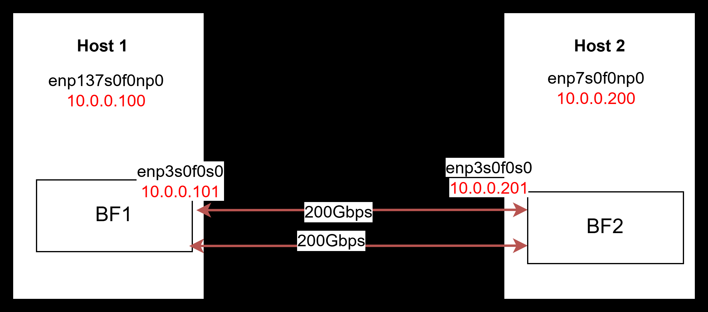

# Connect and Deploy SmartNS

We provide 2 machines for AE reviewers. Each machine is equipped with an Nvidia BlueField-3 B3220 400GbE NIC and connected back-to-back using two 200GbE QSFP56 cables, like this picture, we use **`host1` `bf1` `host2` `bf2`** refer as following . We run application and kernel module on host and run smartns_dpu(core program) on BlueField-3 Arm processor.

**We already do all prerequisite in INSTALL.md**, reviewers can try final Step(Building all SmartNS software) directly.

## 1. Connect to Artifact Machine

**Important: both USER and PASSPORT is: eurosys26**

We already create a sudo user `eurosys26` on all machines, but disable password login for security reasons. You can use the following command to connect to the artifact machine.

1. Download private key `eurosys26_id_ed25519` from the submit website.
2. Get the jump server domain name (use `jump` refer as following) from the submit website, we provide IPV4 server and IPV6 server(recommend).
3. `ssh eurosys26@js.v4.rc4ml.org -p xxx -i eurosys26_id_ed25519`
4. Enjoy for testing
5. If you have any questions, please contact us.

You can find a NFS folder named `nfs`, this folder is located on host1 and shared with host2,bf1,bf2 under NFS, so you can clone SmartNS into this folder can try everything synchronous.

## 2. Load BASIC RDMA kernel module (Must check after each reboot)

~~~bash
sudo insmod ./ib_core.ko 
sudo insmod ./ib_uverbs.ko
sudo insmod ./mlxfw.ko
sudo modprobe tls
sudo modprobe pci-hyperv-intf
sudo modprobe psample
sudo insmod ./mlx5_core.ko
sudo insmod ./mlx5_ib.ko
~~~

## 3. Make sure link is fine~ (Must check after each reboot)

We need to make sure link aggregation works fine, please login to bf1 and bf2 and do following:

~~~bash
ifconfig | grep bond
~~~

If you don't see any output like `bond0: flags=5187<UP,BROADCAST,RUNNING,MASTER,MULTICAST>`, please execute following commands on bf1 and bf2, this needs to be executed after each restart.
~~~bash
sudo ip link add bond0 type bond
sudo ip link set bond0 down
sudo ip link set bond0 type bond miimon 100 mode 4 xmit_hash_policy layer3+4
sudo ip link set p0 down
sudo ip link set p1 down
sudo ip link set p0 master bond0
sudo ip link set p1 master bond0
sudo ip link set p0 up
sudo ip link set p1 up
sudo ip link set bond0 up
~~~

After bond, you can use ping `10.0.0.100`, `10.0.0.101`, `10.0.0.200`, `10.0.0.201` to insure each link is correct!

## 4. Change Link MTU to 9000 (Must check after each reboot)

Please change every interface MTU to 9000

On host1
~~~bash
sudo ifconfig enp137s0f0np0 mtu 9000 up
~~~

On host2
~~~bash
sudo ifconfig enp7s0f0np0 mtu 9000 up
~~~

On bf1 and bf2
~~~bash
sudo ifconfig bond0 mtu 9000 up
sudo ifconfig p0 mtu 9000 up
sudo ifconfig p1 mtu 9000 up
sudo ifconfig enp3s0f0s0 mtu 9000 up
sudo ifconfig pf0hpf mtu 9000 up
sudo ifconfig en3f0pf0sf0 mtu 9000 up
~~~

You can use `ping -s 8192 10.0.0.200` on host1 to check MTU setup correct!

## 5. Build SmartNS

SmartNS include three components: smartns_dpu(running on Arm processor), linux kernel module(running on Host) and uplayer applications(running on host and Arm). 

~~~bash
cd nfs
git clone --recursive https://github.com/RC4ML/SmartNS
cd SmartNS

# exec on host
cd build_host
cmake ..
make -j # build test code and lib

cd ../kernel
make -j # build kerenl module

# exec on ARM (bf1 and bf2!)
cd build_dpu
cmake ..
make -j # build smartns_dpu and test code
~~~

## 6. Deploy SmartNS

To deploy SmartNS, we must run smartns_dpu, load linux kernel module and run user application **IN ORDER**

### 6.1 Running smartns_dpu on Arm process(BF1 and BF2)
On BF2 side
~~~bash
sudo ./smartns_dpu -deviceName mlx5_2 -is_server
~~~

On BF1 side
~~~bash
sudo ./smartns_dpu -deviceName mlx5_2
~~~

### 6.2 Load Linux kernel module(Host1 and Host2)
On host1 and host2 side
~~~bash
cd kernel
./insmod.sh
~~~

### 6.3 Running test(Host1 and Host2)
On host2 (server)
~~~bash
./write_bw -deviceName mlx5_0 -batch_size 1 -threads 1 -outstanding 32 -payload_size 1024 -is_server -iterations 1
~~~

On host1 (client)
~~~bash
./write_bw -deviceName mlx5_0 -batch_size 1 -threads 1 -outstanding 32 -payload_size 1024 -serverIp 10.0.0.200 -iterations 1
~~~

Please note that server will never stop unless CTRL+C, so please manually use CTRL+C for server (host2).

Please use `sudo rmmod smartns` to remove kernel module after client and server finish.

Please use CTRL+C for smartns_dpu after remove smartns kernel module.

